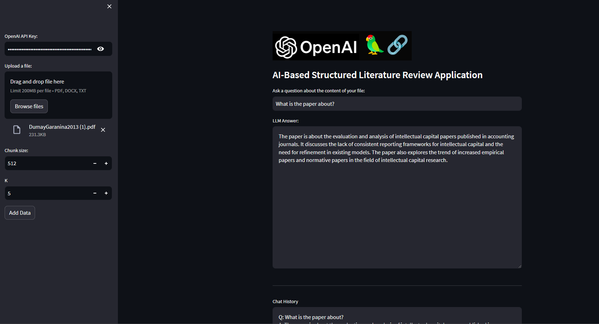

# slrAI
This is a streamlit app that uses OpenAI to parse Pdfs. The idea is to test if it can be used to initially inspects papers to develop an SLR.
To use the app copy your OPENAI_API_KEY in the top left of the screen, upload your pdf and ask questions about it.

Please, remember this is a first attempt. The parsing approach is very basic as it extracts chunks of text from the pdf. Further development could make the function more complex, allow to updload multiple pdfs, etc.

